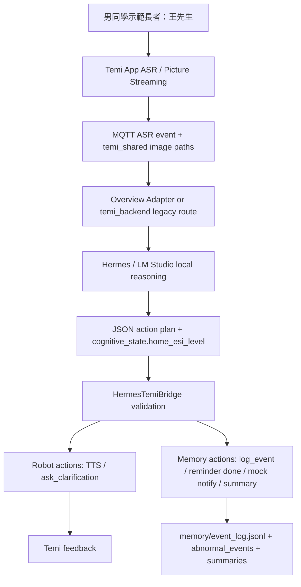

# 第一年度 Demo Runbook

最後更新日期：2026-06-01

## 目的

本 runbook 用於第一年度 Demo 前的排練與現場操作。它把目前已完成的 P0-P3/P5 內容整理成一條可展示、可解釋、可回復的流程。P4 Navigation 先跳過，不作為主線驗收條件。

## Demo 定位

本 Demo 展示的是「具備照護情境理解與安全邊界的 Temi 智慧助理雛形」。核心價值不是醫療診斷，而是：

- Temi App 整合 ASR、TTS、Picture Streaming。
- PC 端透過 MQTT 與 shared image paths 收到事件。
- Hermes / LM Studio 在本地端進行推理。
- HermesTemiBridge 驗證 JSON output 與 robot actions，並把通過驗證的 command 發到 canonical `temi/{robot_id}/cmd/request`。
- Structured memory 記錄提醒、不適、疑似跌倒與摘要。

## 展示架構



## Demo 前 Smoke Test

P0 先前已跑過；現場前建議只做快速確認。

```bash
cd /TemiAgent
python3 tools/e2e_test_runner.py
python3 tools/demo_case_runner.py --keep-artifacts
```

通過條件：

- `e2e_test_runner.py` 回 `status: ok`。
- `demo_case_runner.py` 三個 case 都是 `status: success`。
- `run_summary.json` 內有 L3 reminder、L2 discomfort、L1 possible fall 的 final memory state。

## 現場服務啟動順序

### A. 快速展示備援路線：legacy backend + LM Studio

適合展示 Temi ASR、Picture Streaming、Local VLM、TTS 閉環。

```bash
cd /TemiAgent
./tools/start_temi_pc_services.sh
```

確認：

```bash
./tools/check_temi_connection.sh
```

### B. Overview / Hermes Bridge 路線

先啟動 resident Hermes：

```bash
cd /TemiAgent
python3 tools/hermes_resident_server.py \
  --host 127.0.0.1 \
  --port 8765 \
  --skill-path /TemiAgent/hermes-agent/skills/temi-robot-control/SKILL.md \
  --skill-path /TemiAgent/hermes-agent/skills/temi-care-memory/SKILL.md \
  --skill-path /TemiAgent/hermes-agent/skills/temi-home-esi/SKILL.md \
  --skill-path /TemiAgent/hermes-agent/skills/temi-discord-care-assistant/SKILL.md
```

再啟動 Bridge HTTP mode：

```bash
cd /TemiAgent/hermes_temi_bridge
MQTT_BROKER_HOST=192.168.50.236 \
MQTT_BROKER_PORT=1883 \
TEMI_SHARED_BRIDGE_PATH=/TemiAgent/temi_shared \
TEMI_SHARED_HERMES_PATH=/TemiAgent/temi_shared \
HERMES_INVOKE_MODE=http \
HERMES_HTTP_URL=http://127.0.0.1:8765/invoke \
MEMORY_DIR=/TemiAgent/memory \
LOG_DIR=/TemiAgent/logs/overview_bridge_resident \
uv run --extra mqtt hermes-temi-bridge --env-file /TemiAgent/hermes_temi_bridge/.env.example
```

若要接目前 Temi App 的 legacy ASR 與 camera stream，啟動 ASR/camera-only adapter。command 不經 adapter 轉發，Temi app 會直接訂閱 canonical `cmd/request`：

```bash
cd /TemiAgent/temi_backend
uv run python /TemiAgent/tools/temi_overview_adapter.py \
  --broker 192.168.50.236 \
  --port 1883 \
  --vision-port 8080 \
  --shared-root /TemiAgent/temi_shared \
  --bridge-root /TemiAgent/temi_shared
```

## 展示順序建議

1. 說明計畫書第一年目標：多模態異常感知、個人化提醒、隱私保護資料庫雛形。
2. 說明技術轉換：不做大型知識圖譜，改用 structured memory + Agent skills + Bridge validation；Discord/gateway 也透過 `.hermes.md`、`SOUL.md` 與 `temi-discord-care-assistant` 保持 Temi 居家照護助理身份。
3. 展示 P0：Temi App ASR/TTS/Picture Streaming 已可形成互動閉環。
4. 展示 P1/P2：`memory/` 與 Bridge memory actions。
5. 展示 P3：三個固定照護情境 artifacts。
6. 若現場硬體穩定，再切到 real Temi / real Hermes 路線。
7. 收尾說明 P4 Navigation 是加分整合，後續可接語音或影像觸發移動。

## 風險聲明

- Home-ESI v2 decision-tree 是 Demo 用風險分級規則，不是正式醫療分診。
- `notify_caregiver_mock` 只做 mock notification，不代表真實通報家屬或 119。
- `memory/` 內資料為合成 persona，不含真實個資。
- 第一年度 Demo 強調可展示、可解釋、可擴充，不宣稱醫療級產品化。

## 快速故障切換

| 問題 | 快速處理 |
|---|---|
| Real Hermes 延遲過高 | 切回 `tools/demo_case_runner.py` artifacts 或 mock Bridge。 |
| Discord 要求看手勢但 Hermes 說不能看 | 確認 gateway 工作目錄讀到 `/TemiAgent/.hermes.md`，並執行 `/reload-skills` 或重啟 gateway 讓 `temi-discord-care-assistant` 進索引。 |
| Temi App picture streaming 不穩 | 用 legacy backend route 展示 ASR/TTS，並用 deterministic artifacts 補照護記憶流程。 |
| MQTT command 沒到 Temi | 用 `mosquitto_sub -t '#' -v` 或 `tools/subscribe_cmd_request.sh` 觀察 topic；canonical 主線不應再由 adapter 發 `temi/action/speak`。 |
| Bridge 拒絕 output | 檢查 `cognitive_state.home_esi_level`、`risk_reason`、action schema。 |
